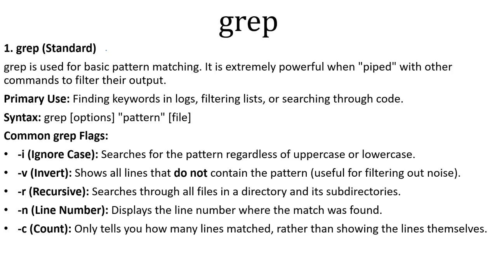
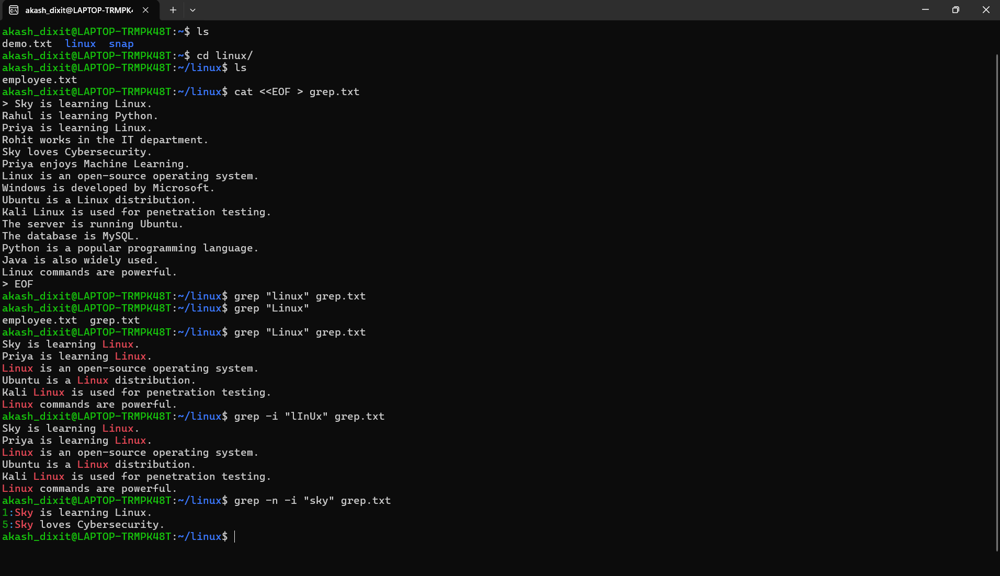
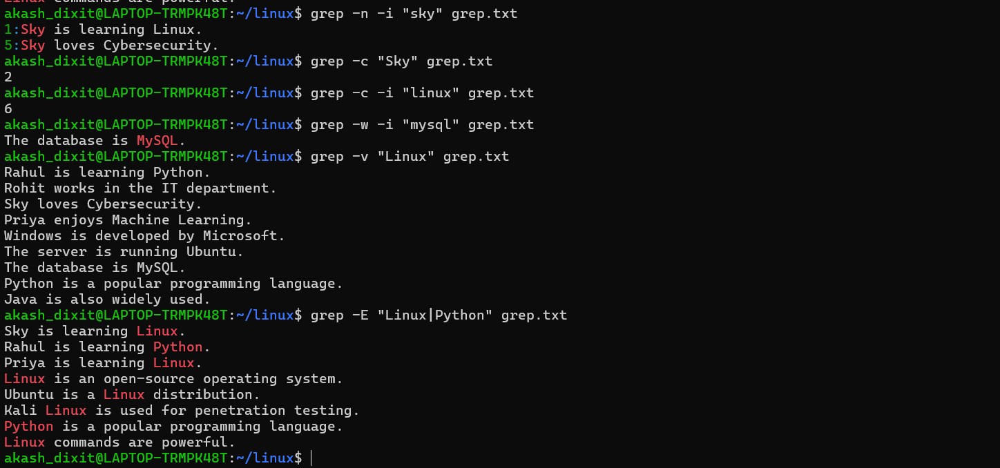

# grep command

  

## TERMINAL PRACTICE SCREENSHOTS:

  

  
</p

---
### 📄 Common `grep` Options

| Option | Description | Example |
|---------|-------------|---------|
| `-i` | Ignore case while searching. | `grep -i "linux" file.txt` |
| `-n` | Display line numbers with matching lines. | `grep -n "Linux" file.txt` |
| `-c` | Count the number of matching lines. | `grep -c "Linux" file.txt` |
| `-v` | Display lines that **do not** match the pattern. | `grep -v "Linux" file.txt` |
| `-w` | Match the **whole word** only. | `grep -w "Linux" file.txt` |
| `-o` | Display only the matched text. | `grep -o "Linux" file.txt` |
| `-E` | Enable **Extended Regular Expressions** (e.g., `OR` using `\|`). | `grep -E "Linux\|Python" file.txt` |

---

#### Quick Revision

- `-i` → Ignore uppercase/lowercase.
- `-n` → Show line numbers.
- `-c` → Count matching lines.
- `-v` → Show non-matching lines (invert match).
- `-w` → Match whole words only.
- `-o` → Print only the matched word.
- `-E` → Use extended patterns (e.g., `Linux|Python` for **OR**).