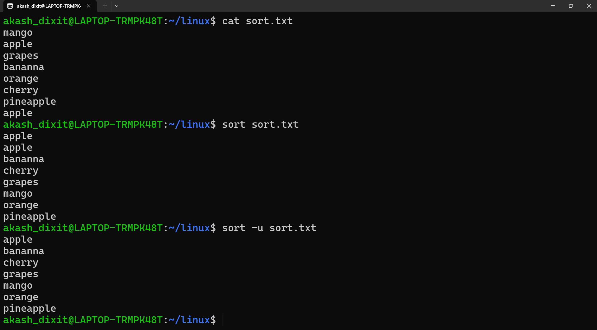
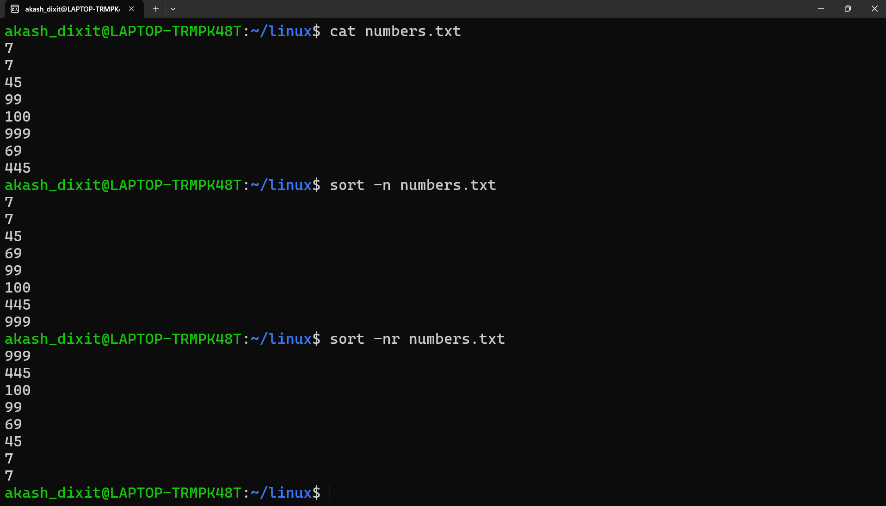
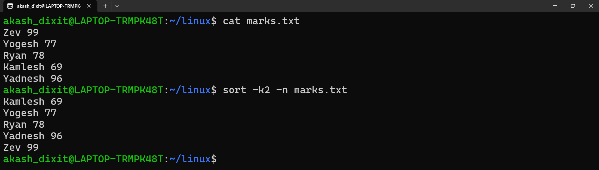

# sort command

## TERMINAL SCREEN SHOTS:

  

  

  
</p

### 📄 Common `sort` Options

| Option | Description | Example |
|---------|-------------|---------|
| `-r` | Sort in **reverse (descending)** order. | `sort -r file.txt` |
| `-n` | Sort **numerically** instead of alphabetically. | `sort -n marks.txt` |
| `-nr` | Sort **numbers in descending order**. | `sort -nr marks.txt` |
| `-k2` | Sort using the **2nd field (column)** as the key. | `sort -k2 employee.txt` |
| `-k2 -n` | Sort **numerically** using the **2nd field**. | `sort -k2 -n marks.txt` |

---

## Quick Revision

- `-r` → Reverse (descending) sort.
- `-n` → Numeric sort.
- `-nr` → Numeric + reverse (highest to lowest).
- `-k2` → Sort by the 2nd column.
- `-k2 -n` → Numerically sort by the 2nd column.