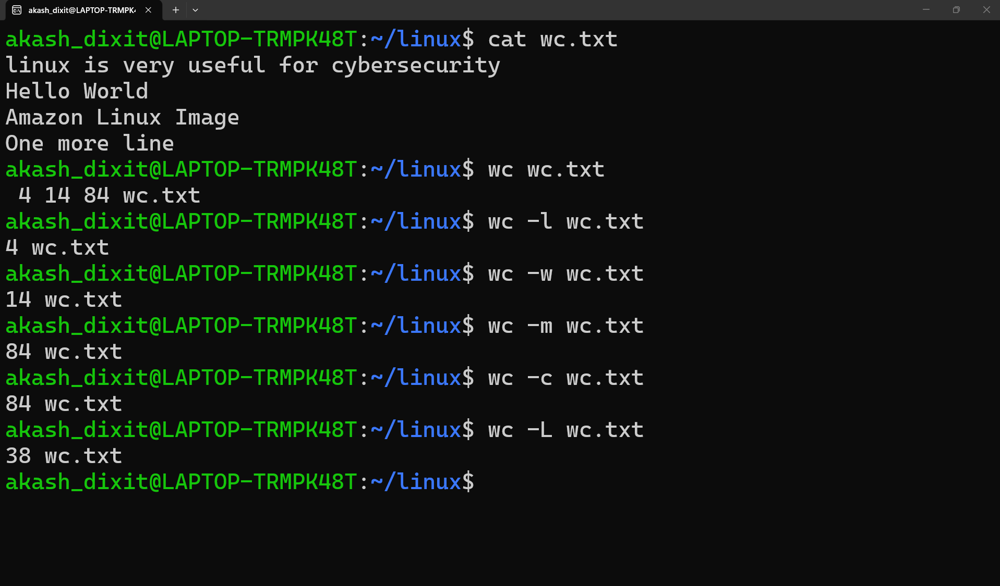

# wc command

## Screen Shots from terminal:
<p align="center">
  
</p>

## Definition

**`wc`** stands for **Word Count**.

It is used to **count the number of lines, words, bytes, and characters** in a file or command output.

## Syntax

```bash
wc [OPTIONS] file
```

## Basic Command

```bash
wc wc.txt
```

Output:

```text
4  15  100  wc.txt
```

The values represent:

```text
Lines   Words   Bytes   Filename
```

---

## Common Options

| Option | Description |
|--------|-------------|
| `-l` | Count **lines**. |
| `-w` | Count **words**. |
| `-c` | Count **bytes**. |
| `-m` | Count **characters**. |

## Examples

```bash
wc -l wc.txt
```

→ Counts lines.

```bash
wc -w wc.txt
```

→ Counts words.

```bash
wc -c wc.txt
```

→ Counts bytes.

```bash
wc -m wc.txt
```

→ Counts characters.

---

## Quick Revision

- `wc` → Word Count
- `-l` → Lines
- `-w` → Words
- `-c` → Bytes
- `-m` → Characters