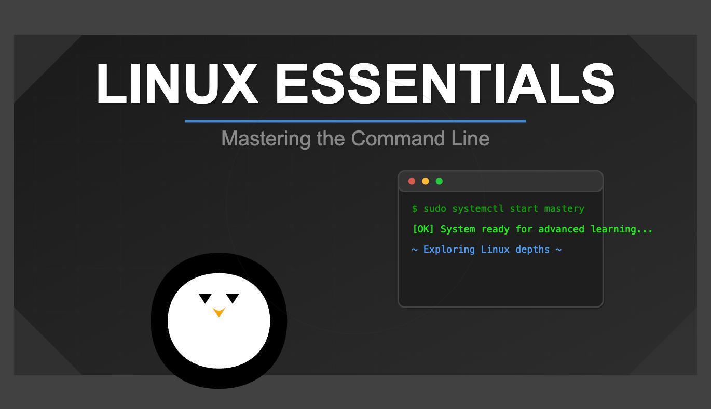

# 🐧 Linux Notes

  

> My personal Linux notes, commands, and hands-on practice while learning Linux from scratch.

This repository documents my Linux learning journey—from understanding basic terminal commands to exploring file systems, permissions, shell scripting, package management, and more. These notes are written in a simple and beginner-friendly way to help reinforce my own understanding while also serving as a useful reference for others starting with Linux.

---

## 📖 About

This repository includes:

- 📝 Well-organized Linux notes
- 💻 Common Linux commands with explanations
- ⚡ Terminal shortcuts and productivity tips
- 📂 File and directory management
- 🔐 File permissions and ownership
- 🔍 Searching and filtering commands
- 🛠️ Shell basics and scripting
- 📚 Hands-on practice and exercises
- 🚀 Additional tips and cheat sheets

---

## 🎯 Goals

- Build a strong foundation in Linux.
- Learn by practicing commands instead of memorizing them.
- Maintain a personal knowledge base.
- Track my learning progress.
- Prepare for Cybersecurity and DevOps.

---

## 🚀 Why I Created This Repository

I wanted one place to store everything I learn about Linux while practicing daily. Instead of keeping scattered notes, this repository serves as my digital notebook that I can revisit anytime. It also helps me document my progress and strengthen my understanding through consistent practice.

---

## 💡 Note

These notes are continuously updated as I learn new Linux concepts. If you find any mistakes or have suggestions, feel free to open an issue or submit a pull request.

---

## ⭐ Support

If you find these notes useful, consider giving this repository a ⭐.

Happy Learning! 🐧